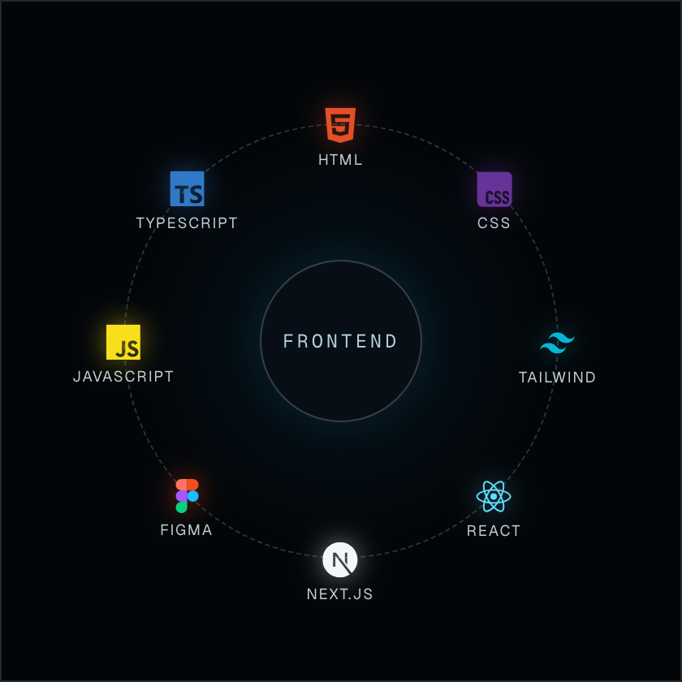
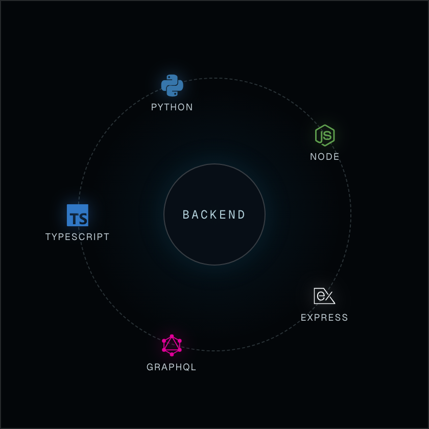
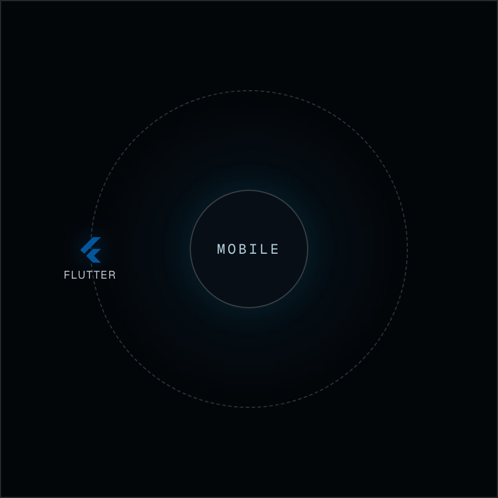
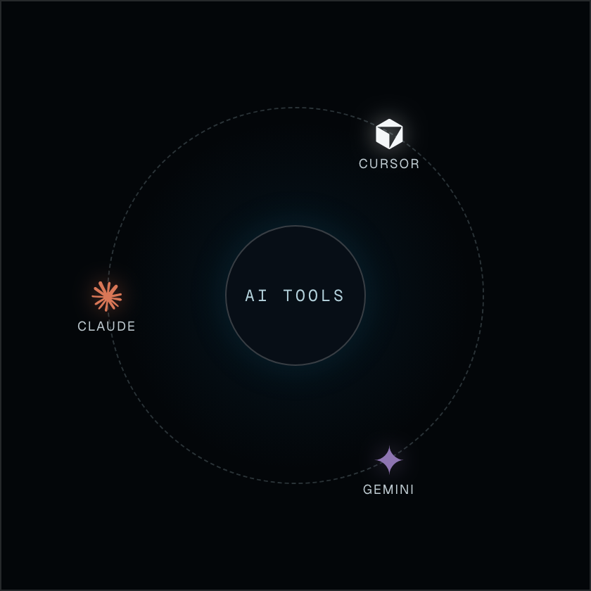
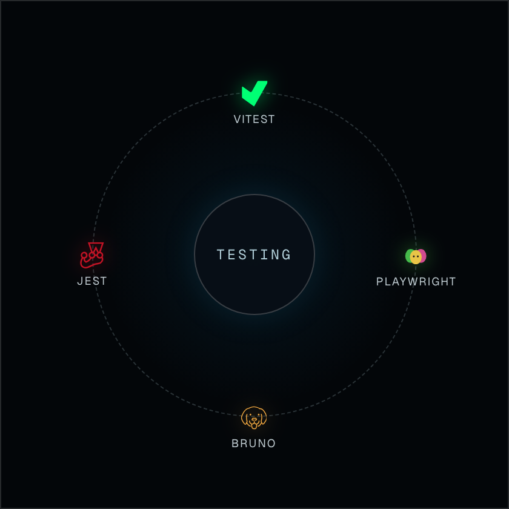
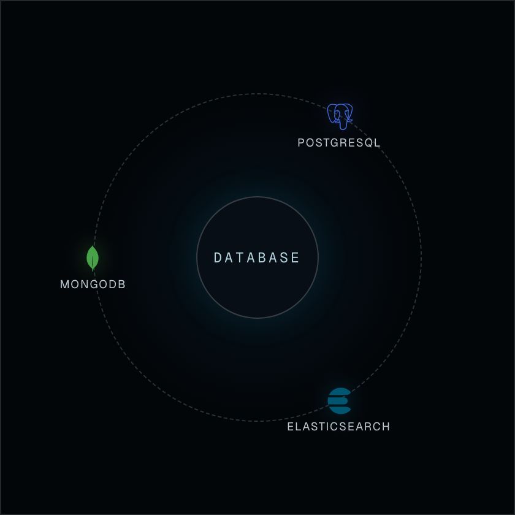

  

  
  &nbsp;&nbsp;
  
  &nbsp;&nbsp;
  

## About

Hey, I'm **Richard**, a **full-stack engineer** from Budapest, Hungary. I'm passionate about building web applications with user-friendly interfaces, and high-performance APIs. I love coming up with simple, elegant, and efficient solutions to complex problems.

Lately, I've been especially interested in finding the middle ground between human and AI work; utilizing AI tools to enhance my workflow without displacing the critical thinking, and creativity that makes engineering so rewarding.

## Skills

  
  &nbsp;
  
  &nbsp;
  

  
  &nbsp;
  
  &nbsp;
  

